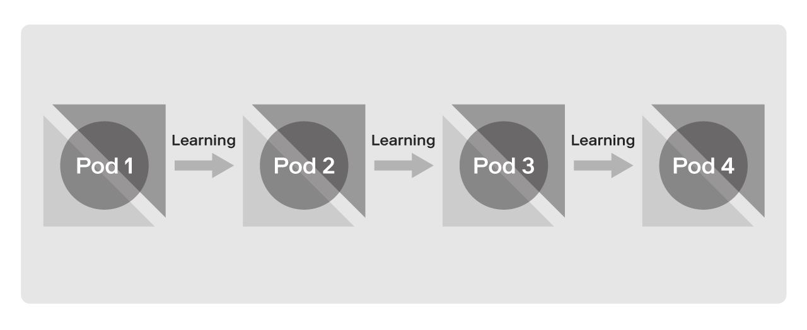

# Why it works

As noted earlier, thin-slicing is an effective way to use a hypothesis driven thinking to not only deliver meaningful business outcomes, but also to test the future state in a deeply inclusive and integrated way. In our opinion, applying the Improvement Kata in conjunction with thin-slicing is the fastest way to validate assumptions and learn what works, and what doesn’t. As shown in Figure U below, this rapid learning will ultimately enable your organization to distill that learning downstream, and across the organization to avoid repeating the same mistakes over again.

