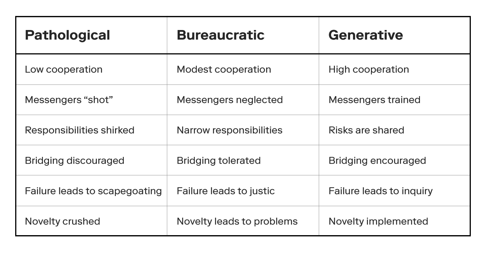
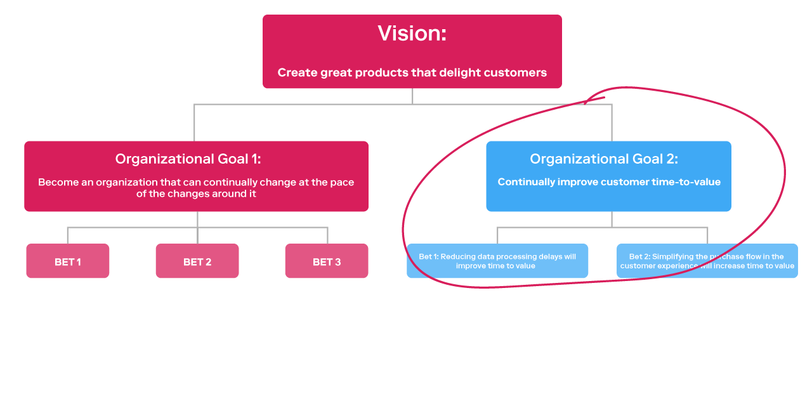
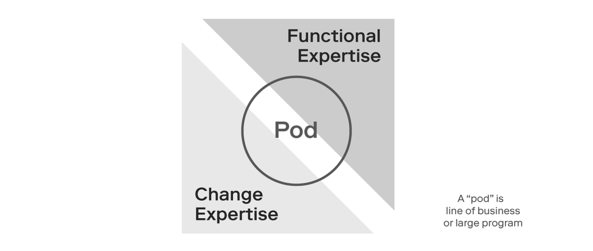

# First Draft

_The Better Way:_ A transformation strategy for the real world

Left Title Page

Contents

[**Foreword**]() **6**

[**Preface**]() **7**

[**Part I: The Big Picture**]() **9**

[**Introduction**]() **11**

[Radical change]() 12

[Evolving consumer preferences]() 12

[Business model innovation]() 12

[Rapid Acceleration]() 13

[Exponential technological progress]() 13

[Profound complexity]() 14

[Organizational structure]() 14

[Mindset & culture]() 15

[Legacy technology]() 16

[Budgeting]() 17

[Section Summary]() 18

[**Part II: The better way**]() **19**

[**Introduction:**]() **20**

[Principle One: When in doubt, prioritize customer value and adaptability]() 21

[Shift CVA to the center of the business]() 22

[Portfolio Management - Prioritize by value]() 22

[Apply an outcome based strategy]() 22

[Thin-slice to improve end to end]() 23

[Applying the principle in practice:]() 24

[What good looks like:]() 24

[Common failure modes:]() 25

[Example case study:]() 25

[**Principle Two: Modernize your measures of success**]() **26**

[The solution:]() 27

[Applying the principle in practice:]() 27

[What good looks like:]() 27

[Common failure modes:]() 27

[Case study:]() 28

[**Principle Three: Place technology at the core of your business strategy**]() **29**

[The challenge:]() 29

[The solution:]() 29

[Applying the principle in practice:]() 30

[What good looks like:]() 30

[Common failure modes:]() 30

[Case study:]() 30

[**Principle Four: Shift to product teams**]() **31**

[The challenge:]() 31

[The solution:]() 31

[Rethinking the organizational model]() 31

[Prioritization and portfolio management]() 32

[Ensure clarity of purpose]() 32

[Shift the mindset]() 32

[Breakdown functional silos]() 32

[Modernize the budgeting model]() 32

[Bring work to the people]() 32

[Embrace constant beta]() 33

[Evolve roles]() 33

[Applying the principle in practice:]() 34

[What good looks like:]() 34

[Common failure modes:]() 34

[Case study:]() 34

[**Principle Five: Build a responsive organization**]() **35**

[The challenge:]() 35

[The solution:]() 35

[Applying the principle in practice:]() 35

[What good looks like:]() 35

[Common failure modes:]() 35

[Case study:]() 35

[**Part III: Making it work in the real world**]() **36**

[**Making it work: Micro-transformations are the faster, safer, better way to learn fast and achieve results**]() **37**

[Tactic 1: Thin-slice the transformation effort]() 38

[Coalition]() 40

[Crafting the first slice]() 40

[Crafting measures of success]() 42

[Summary]() 43

[Tactic 2: Form coalitions to overcome dependencies and constraints]() 44

[The Double-Triangle model]() 44

[Stage one]() 45

[Stage two]() 45

[Stage three]() 45

[Tactic 3: Create an immersive work environment]() 47

[Tactic 4: Develop partnerships to overcome the strategy to delivery gap]() 48

[**Section Summary:**]() **49**

[**Appendix**]() **50**

[What is digital transformation?]() 50

[Why transformations often fail]() 52

[The ten most common failure modes:]() 52

[Big-bang transformation]() 52

[BAU transformations]() 52

[Forgetting to implement]() 52

[Diving deep on organizational and functional constraints]() 53

[Organizational constraints]() 53

[Organizational structures]() 53

[The challenge]() 53

[The solution]() 55

[Strict adherence to job titles and roles]() 56

[The challenge]() 56

[The solution]() 56

[Avoidance]() 57

[The challenge]() 57

[The solution]() 58

[Culture]() 58

[The challenge]() 58

[The solution]() 58

[Functional Constraints:]() 58

[Finance]() 59

[The challenge]() 59

[Budgeting is cumbersome and too expensive]() 59

[The solution]() 60

[HR]() 60

[LRC]() 60

[**Glossary**]() **62**

[**List of Figures & Tables**]() **63**

[http://download.microsoft.com/download/0/4/3/0430CF1B-0E7B-44E0-BAF4-23C03E12F065/The\_Digital\_Business\_Divide\_white\_paper.pdf]() 7

Left Title Page

## 

## Foreword

## Preface

As exponential technological advancements, new business models and ephemeral consumer appetites fuel demand for increasingly sophisticated, personalized and evolvable experiences, many organizations find they lack the strategy and capability needed to compete in the digital first economy.

In fact, recent research[\[1\]]() suggests that a clear digital capability divide is forming, creating increasingly high digital barriers to entry which cannot be overcome by throwing more money or people at the problem.

What’s more, many organizations realize far too late that there is no silver bullet solution and digital transformation is not a one time investment that can be outsourced or delivered ad hoc.

Instead, it must be seeded, grown and harvested through a process of continual observation, investment and commitment to business strategy and operating model reinvention.

This can only be accomplished through the ongoing elaboration of a fully digital operating model that is designed to strategically add capabilities and reduce the barriers to entry that prevent innovation.

But for established companies, particularly those with roots that date back several generations, this is no easy feat.

Oftentimes, transforming requires fundamentally changing the business strategy and business model as well as making significant efforts to modernize the organizational DNA in order to reduce complexity and tighten the strategy to delivery gap.

And if your organization is in the process of transforming, or considering transformation, there are often more questions than answers.

Where do we start? How much planning is appropriate? How will we allocate funds and resources? What are the key measures of success?

Although these are entirely reasonable questions to ask, we believe the better question to start with is “what does our future state look like?”

To answer this can be tricky, so it helps to approach the question from the right altitude. It’s got to be high enough that you can view the entire landscape and the interplay between culture, customers, competitors, ways of working, technological capability and so on, but low enough to spot real transformative opportunities to deliver iterative and incremental value in months, not years.

Here, we’ve attempted to uncover those opportunities by distilling our most recent real-world experience working with hundreds of our clients that are likely to have many of the same challenges you do.

What we’ve found, is that attempting to precisely copy what worked well for one organization will not necessarily succeed for another. In fact, in most cases, this approach is likely to produce disastrous results.

For that reason, we prefer to guide with principles. Principles are neither dogmatic nor rigid. They simply guide the path to a better way. They can be applied as much or as little as needed to as a means of wayfinding, calibrating and resolving transformation challenges as they are discovered.

To help make the principles real, we’ve included tools to help you apply the principles in practice, get a sense of what good looks like, and watch out for common failure modes. We’ve also included some sample case studies that are based on our own real world experience.

So no matter where you are on your transformation journey, we hope this eBook provides meaningful insight, utility and a sense of direction when times get tough. And they will. For those times, we hope you’ll return to the principles in this book.

## Part I: The Big Picture

## 

### 

### 

### 

### 

## Introduction

Radical change, rapid acceleration, profound complexity. This is the big picture that represents a new digitally driven reality.

There will be no exceptions, and no exemptions. No matter where your company stands today, at some point, your organization will need to transform digital from an existential threat into an opportunity.

For leaders, pressure to embrace digital has been mounting for years, and many have tried, but for most, getting it right has proven elusive, if not downright vexing. Nevertheless, companies everywhere, across every industry and vertical are doubling down on digital, making deep investments in the hopes of catching the next big wave.

And while any organization can achieve some level of success with enough time, money and dedication, most have yet to realize truly transformational results.

In our experience, when an organization fails to see results from their digital investments, it’s often because of a reluctance to change what’s working now, so they attempt to “transform” by implementing digital from the margins. But this approach often fails because digital cannot be implemented from the margins. It must be completely into the core of the organization, starting with the operating model.

But even for those organizations that know they must integrate digital into their core, the question of course, is how? How do you integrate digital into the core of your business in a pragmatic way? How do you operate differently? And where do you start?

This is what this book will show you how to do in three parts.

In Part I, we will explore radical change, rapid acceleration and profound complexity, which respectively, represent the fundamental drivers and challenges that all organizations must understand before defining their digital transformation strategy.

In Part II, we will explore five guiding principles that work well in unstable environments with uncertain outcomes. These principles can be used to transform your operating model in a pragmatic and human centered way that aims for simplicity and utility.

Finally in Part III, we will demonstrate how to make Parts I and II actionable, using a micro-transformation model that will enable you to iteratively and incrementally transform into a digital enterprise.

&lt;What can I add here to close this off? Add later after talking to Nick?&gt;

### Radical change

#### Evolving consumer preferences

_“Any customer can have a car painted any colour that he wants, as long as it’s black.”_

_Henry Ford_

Consumers today have more choice than ever, and their loyalties are increasingly gravitating toward brands that offer personalized, evolvable and frictionless experiences across every touchpoint.

Not only that, but thanks to modern digital technology, the voice of the customer is exponentially louder than it has ever been, and this has fundamentally altered the power balance between brands and consumers.

As a result, companies today must embrace the notion that a world class digital customer experience is essential for survival.

This is because consumers today, the high watermark of customer experience is not defined by those of your closest rivals, it's defined by every digital experience that exists in your customers digital ecosystem.

What this means is that organizations must do significantly more than simply lift and shift an aging service to the cloud and apply some modest user interface enhancements.

Instead, companies must modernize the entire customer journey from end to end, ensuring that every experience is fast, personalized, and evolvable. Otherwise, your customers may become easy targets for motivated startups with clever and attractive new business models.

#### Business model innovation

Consumers today are no longer starved for choice because there are literally thousands of well funded upstarts coming to market each year with creative new business models that offer better value and newer, more customized and differentiated experiences.

And so far, it seems that no industry is immune. Fueled by technology, incumbents in every industry and vertical are finding themselves disrupted by the clever application of a technique known as decoupling, that is designed to break apart what Harvard professor Thales A. Texeira refers to as “the customer value chain”. In his 2019 book entitled, _Unlocking the Customer Value Chain_, Texeira describes how upstarts can disrupt incumbents by eliminating as many non-value added activities from the customer experience as possible.

&lt;insert image to make this concept more clear?&gt;

Amazon provides a classic example of how to disrupt an established customer experience using this approach. In Amazon’s case, they successfully decoupled the traditional book purchasing experience by eliminating non-value adding activities from the existing customer experience. They did this by removing the non-value adding activities like travelling to the store, searching long stacks of books and waiting in line to pay with value-adding activities like home delivery, digital search and one click purchasing. With Kindle, their eBook service, they again applied digital technology to significantly increase customer time to value and scale competitive advantage.

There are many examples of this. Texeira also points to how Netflix successfully offered customers an unrivalled entertainment experience in terms of variety, price and time to value, while leaving telecom providers to fulfill the costly and complex work of delivering internet connectivity service.

And while Amazon and Netflix are no longer upstarts, for incumbent organizations, the threat of new upstarts with similar potential will continue to pose a significant existential threat as interconnectivity between devices and lower transaction costs merge with unprecedented AI and automation capabilities.

What this means for incumbent organizations is that they must learn to disrupt, defend and differentiate in order to avoid becoming disrupted and displaced themselves.

### Rapid Acceleration

#### Exponential technological progress

“We live in exciting times of fundamental technological change” wrote Marc Benioff, the Chairman and CEO of Salesforce in the Foreword to 2014’s _The Fourth Industrial Revolution_, by Klaus Schwab.

Exciting times indeed. In fact, according to Schwab, the fourth industrial revolution will fundamentally, “alter the way we live, work and relate to one another. In its scale, scope and complexity, the transformation will be unlike anything humankind has experienced before.”

To get a sense of what the future will look like, consider this. In the _Future Is Faster Than You Think_, authors Peter Diamandis and Steven Kotler explain how Uber, among many others, are planning to solve the problem of urban mobility with aerial ridesharing. Their plan is to have aerial ride sharing fully operational in some U.S. cities by 2023, with the ultimate goal of making owning a personal vehicle economically irrational. They plan to do this by finding ways to leverage technology to drive down the cost per mile.

But flying vehicles are just the tip of the iceberg, and many experts believe we are now at the tipping point of convergence, a point at which formerly independent streams of technology begin to exponentially scale and come together, enabling innovation to occur in ways we can’t even fully comprehend yet.

This means that as quantum computing, artificial intelligence, robotics, blockchain, virtual reality and nanotechnology scale, so too will opportunities for leading organizations to catch the next wave of innovative and develop provocative new business models, products and services.

### Profound complexity

#### Organizational structure

Most companies today are “divided hierarchies”, a term coined by author Dave Gray in his book, _The Connected Company_.

In a divided hierarchy, work is essentially divided up and distributed into zones with each zone performing highly specific, repeatable and well defined tasks that are delegated top down in a command and control style.

Figure N: Illustration of Dave Gray’s “divided company”

Divided hierarchies are designed to create value by maximizing efficiency and scale, and they work exceptionally well in stable environments like manufacturing, where work is often routine, repetitive and knowable.

But divided hierarchies are much less effective when applied to unstable environments like digital, where value is generated by innovation, and the work is considerably more adaptive, dynamic and unknowable.

For transforming organizations, outdated organizational structures that are not fit for purpose can be a significant impediment. To become a truly digital enterprise, organizations must adopt an organizational structure that is fit for purpose and designed to maximize the key enablers of innovation i.e. high quality information flow, cross-functional collaboration and learning.

The solution, which we explore in more detail in Parts II and III, is for organizations to transform their divided hierarchical organization into network based organizations which are designed to maximize autonomy, collaboration and flow, the key enablers of innovation.

#### Mindset & culture

As we noted earlier in this section, many organizational challenges that inhibit transformation progress are tightly coupled. This is particularly true of the relationship between organizational structures \(discussed above\) and organizational mindsets and culture.

Some might even say they are two sides of the same coin, with the key distinction being that organizational structure strongly influences how work flows, i.e. how it is distributed and delivered, while organizational culture strongly influences the mindset and behaviour of those performing the work.

In our experience, rigid and hierarchical organizational structures tend to foster mindsets and cultures that reflect those traits, which are likely to manifest in beliefs and behaviours that are sub-optimal for an adaptive environment like digital.

This is because in adaptive environments, ambiguity is often high, and employees need to feel safe to ask questions, experiment and apply divergent thinking in order to discover the right solutions for the challenge at hand.

In his 2014 paper entitled, _A typology of organisational cultures_, sociologist and professor Ron Westrum studied organizational culture in complex and risky environments and developed a typology he calls _The Three Cultures Model_. In it, Westrum’s findings indicated that organizations are largely either pathological, bureaucratic or generative based on the following traits.

| **Pathological** | **Bureaucratic** | **Generative** |
| :--- | :--- | :--- |
| Low cooperation | Modest cooperation | High cooperation |
| Messengers “shot” | Messengers neglected | Messengers trained |
| Responsibilities shirked | Narrow responsibilities | Risks are shared |
| Bridging discouraged | Bridging tolerated | Bridging encouraged |
| Failure leads to scapegoating | Failure leads to justice | Failure leads to inquiry |
| Novelty crushed | Novelty leads to problems | Novelty implemented |

Table N: Westrum's Typology of Organizational Culture

One of Westrum’s key findings was that safety has a key predictive relationship in organizational performance, particularly in complex and risky environments, i.e. digital innovation.

For transforming organizations, this is a key challenge that must not be overlooked. As noted earlier, digital enterprises create value through innovation, and innovation cannot succeed in an environment that is unfit for that purpose.

The solution, which we explore in more detail in Parts II and II, is to develop a culture and mindset ecosystem that encourages behaviours that are fit for purpose and influence performance.

&lt;sidebar: learn more about culture and mindset ecosystems in the appendix&gt;

#### Legacy technology

While outdated organizational structures and sub-optimal mindsets and cultures are significant challenges on their own, many organizations are also grappling with outdated and expensive systems and platforms.

At the heart of the challenge is the question of how to either modernize or replace many of the vital platforms and systems that underpin their daily operations.

It is a significant challenge that historically many enterprise organizations have avoided due to mounting technical debt linked to monolithic code bases and poor modularity.

Essentially, this challenge leaves leaders with a range of poor options to choose from. To rewrite their core applications from the ground up involves significant cost and risk while the cost of doing nothing only increases by the day and further exacerbates the existing problem. Alternatively, they may choose the lesser evil and buy some time by incrementally reducing their technical debt, however the underlying issues remain the same.

This is often referred to as the legacy system trap.

Of course, this is only one side of the coin. As discussed throughout this book, a digital enterprise fundamentally creates its value by bringing innovative products and services to market, and this is exceptionally hard to do when product teams are constrained by systems that cannot create the digital assets they require.

The solution, which we explore in more detail in Parts II and III, is to prioritize customer value and incrementally modernize, replace or purchase only what is necessary to maximize and deliver that value, while implementing a longer term strategy to eliminate systems that are no longer fit for purpose.

#### Budgeting

Just as fixed and divided hierarchies are ineffective when applied to adaptive working environments, so too, are fixed budgeting processes.

Digital is just too dynamic and fast-changing for an annual or even quarterly budgeting process to work. It’s simply too inflexible to be compatible with work that is emergent and unknowable.

And while there are a number of challenges we could cover here, we’ve highlighted three that must be addressed to enable a truly digital enterprise.

The first challenge occurs during the annual budgeting process when managers are asked to produce high fidelity business cases based on nothing more than an untested hypothesis.

Generally, this lengthy and cumbersome process produces very little tangible value and often amounts to nothing more than an attempt to demonstrate due diligence and governance. Moreover, once a business case is actually approved, funding is essentially “locked-in” leaving little room to either increase funding as value scales, or to redistribute funding to more promising opportunities.

Worse still, in many cases, the key measure of success is adherence to budget, rather than how much organizational value is created.

This brings us to the second challenge, which is how funding is allocated. In most organizations, funding is typically allocated by department or function which tends to further reinforce divided and hierarchical thinking and encourage local optimizations that are often unrelated to the broader business strategy.

&lt;add in a third one that briefly explains why this keeps happening, and why it’s so hard to overcome it - what is the organizational psychology that is driving&gt;

The solution, which we explore in more detail in Parts II and III, is to replace the lengthy low value adding annual budgeting process with an incremental model that releases funding as value based measures of success are achieved or new higher value opportunities are discovered.

### 

### 

### Section Summary

As we’ve seen, when consumer preferences merge with new business models and combine with rapidly progressing technologies, the inevitable result is a paradigm shift, and a new reality. And while paradigm shifts often take considerable time to scale, mature and gain acceptance, they eventually reach a turning point and become widely and rapidly adopted.

For many organizations, that turning point was 2007, when Apple introduced the iPhone, Google unveiled Android, and many other innovative companies scaled their technology platforms to fundamentally change the way we live, work and interact with one another.

And now, more than a decade later, and in spite of massive investments and multi-year digital transformation programs, many companies are still struggling to adapt to the new digital reality. Not that they haven’t tried, but the reality is that [eight out of ten digital transformation initiatives fail](https://www.zdnet.com/article/when-digital-transformation-fails-focus-on-the-why-and-how-of-change-not-just-technology/#:~:text=Lack%20of%20alignment%20and%20clear,is%20a%20waste%20of%20time).

And although the 80% failure rate is unfortunate, it is also not surprising given that oftentimes, an organizations' transformation strategy is in fact, not a strategy at all. Instead, the “strategy” is nothing more than a set of broad aspirational statements accompanied by a to-do list of outputs that are largely disconnected from any business strategy or measurable business outcomes.

It’s hard to know exactly why organizations choose this path, other than to assume their goal is to avoid the pain and complexity that comes with true organizational change. What is clear however, is that in order to join the 20% that succeed, organizations must transform strategically, and commit to an ongoing process of evaluation and evolution.

Here, the operating model is key. It is the central nervous system of your organization that governs and regulates how you work, what you prioritize, when you invest, and how you measure success. It is the bridge between strategy and execution and the primary driver behind how your organization works.

It is the key component of a responsive, resilient and adaptive organization.

In Part II, we’ll explore five principles your organization can use to transform your existing operating model in a pragmatic and strategic way using an iterative, incremental and human centred approach that we call, _The Better Way_.

## 

## 

## 

## 

## Part II: The better way

Left hand page

## 

## Introduction:

Digital transformation has two key goals. The first is to build an organization that is capable of adapting to change as it occurs, and the second is to build the capabilities that enable digital to identify and create business and customer value.

As noted previously in _The Big Picture_, the operating model is the key to enabling both of these goals.

But chances are, your existing operating model will not do. It is likely too linear, deterministic, and hierarchical to achieve the first goal, and it is also likely too disconnected from the business strategy to accomplish the second goal.

Here in _Part II: The Better Way_, we’ll explore how to apply five principles that will help you create an operating model capable of achieving both goals in a strategic way that is iterative, incremental, and human centered.

&lt;insert triangle image of operating model&gt;

&lt;explain how the principles will help cover each of the triangles&gt;

### Principle One: When in doubt, prioritize customer value and adaptability

In Part I, we described how radical shifts in the business landscape and rapid technological progression have catalyzed massive corporate investments in digital transformation. We also explored how profound internal complexities often conspire to derail and limit the impact of those investments.

For leaders, navigating all of these challenges can be overwhelming and often lead to a series of fragmented initiatives that waste precious resources and produce limited strategic benefit.

To overcome this, organizations must implement a guiding policy capable of strategically prioritizing initiatives in a way that will maximize and compound the impact of invested resources.

In our view, the best way to do this is to prioritize initiatives that either create customer value or drive increased organizational capabilities, but ideally both.

Why? Because when resources are finite, it helps to invest those resources into initiatives that customers actually value and are willing to pay for now, while also building the internal capability to anticipate their needs in the future as well.

To overcome this challenge, organizations should realign the business to focus on customer value and adaptability, aka \(CVA\). This means shifting CVA to the center of the business strategy as well as using it to direct the evolution of the business, operating and infrastructure model. Moreover, CVA should be a first order priority in terms of capability building within each of the core digital competencies i.e. Strategy, Product, Experience, Engineering and Data.

#### 

#### 

#### Implementing CVA

From a birds-eye view, a good strategy has three key components. First, it provides a clear diagnosis of the challenges at hand. Second, it articulates a guiding policy for dealing with the challenges, and third, describes a coherent set of actions to be carried out.

In terms of the diagnosis, we’ve already defined the challenge at hand, namely the fundamental shift in the power balance between companies and customers, and the need to continually adapt to rapid technological progress.

Here, we will suggest shifting CVA to the centre of the business is an appropriate guiding policy because it provides direction to inevitable questions about the future-state such as “how will we work together, how will we prioritize and what will we invest in?”

With CVA, the answer to those questions will always be, “initiatives that maximize either customer value or adaptability, but ideally both.”

As a guiding policy, CVA sets the foundation for the transformational shift in mindset that must happen in order to avoid wasteful initiatives, neutralize unaligned interests and minimize unnecessary bureaucracy.

It provides the clear starting point from which an organization can begin building shared understanding, alignment, and a strong foundation upon which to build a digital enterprise that is built to last, through continual evolution.

Without this, it will be almost impossible to create a unifying point of focus from which leaders can transform their business, operating and infrastructure models.

To get started, here are three key areas of focus that can help:

**CVA Business Strategy**

Although many companies find their ability to invest in future growth ability to business is an infinite, rather than finite game.

This is particularly true in the digital realm where new competitors and new business models can change the game in innumerable ways in a relatively short period of time.

 There are no winners or losers per se, just an endless Anchoring business strategy on the customer rather than your competition is one of the most fundamental shifts in thinking that many organizations must make as they make the transition to a digital enterprise.

**CVA Business Model**

How do we create value, and for whom?

How do we capture value, and from whom?

**Portfolio Management**

This section outlines modern ways to approach Portfolio Management:

* Align the
* Review the portfolio quarterly, focus on 3 time horizons using the horizon model
* Balance the portfolio and the demand for resources with the zone model
* Use PAPRIKA to evaluate ini

**Apply an outcome based strategy**

One way to operationalize a customer centric vision is to implement an outcome based strategy.

The goal of an outcome based strategy is to distill the executive vision and business strategy into increasingly smaller and more discreet tranches of customer value that cascade downward through all levels of the organization.

When done well, it provides everyone in the organization with the ability to connect the dots moving all the way from the executive vision and the business strategy to each of the specific goals, experiments and initiatives.

Figure 2: &lt;add later&gt;

Add more later to explain what’s included in an outcome…

**Thin-slice to improve end to end**

important that we ask the question thinking end to end. And when we say end to end, we’re not talking about lifting and shifting an existing product to the cloud, or putting a shiny new UI on an outdated product. When we say end to end, what we mean is, improving every touchpoint that exists between the business and it’s customers, partners and vendors.

To do this right will often require collaboration with the frontstage functions i.e. marketing, customer support, fulfillment as well as the backstage functions i.e. legal, regulator, operations.

Figure 3: &lt;insert a Ranglely diagram similar to this one here&gt;

By way of example, consider the

#### 

Figure 3: &lt;insert a Ranglely diagram similar to this one here&gt;

Nunc tincidunt tortor lectus, sit amet vestibulum est aliquam a. Maecenas molestie molestie massa ac scelerisque. Vestibulum in faucibus velit. Vivamus non lorem eu diam lacinia luctus nec in augue. Cras auctor ante tempus, tincidunt urna eget, iaculis sem. Nunc ultricies justo vel dignissim placerat. In hac habitasse platea dictumst. Praesent libero odio, luctus ut malesuada sed, aliquam ac magna. Nullam et posuere nibh, scelerisque lacinia lorem. Nullam sit amet nulla in ipsum viverra sollicitudin iaculis a orci. Phasellus placerat leo felis, finibus efficitur felis porttitor eget. Ut dignissim est sed neque dignissim, nec viverra velit pharetra. Morbi pulvinar enim ut condimentum viverra.

### Applying the principle in practice:

* Align and focus the vision, goals, bets, initiatives around customer value
* Cascade value downward starting at the vision, in smaller and smaller tranches of work
* Define value as customer outcomes that improve segments of the customer journey

### What good looks like:

* Strategic outcomes are based on outcomes, not outputs
* Outcomes clearly create value to for customers \(either internal or external\)
* Teams are empowered to discover value through rapid envision/explore cycles
* Funding is allocated/increased as the likelihood of success scales
* Capability building is customer centric and seen as an organizational asset

### Common failure modes:

* Confusing outcomes and constraints - it's important to measure value based on outcomes and avoid using measurable customer-value outcomes, not internal measures such as ROI. Don’t take this to mean that ROI isn’t important—in fact, it is very important. ROI just isn’t a goal, but rather a constraint. The organization has to make a profit to be a viable business. But what is the best way to make that profit? We believe it is focusing on outcomes rather than internal outputs.
* Failing to clearly define what customer value means to your organization is so that it can be properly captured and measured: _To help with this, we’ve provided our definition of customer value in the_ [_Glossary_](https://docs.google.com/document/d/14nzdtU5Vo3gnN7Tj-SjLaFYuTH4I3IO9GofWZEe4t14/edit#)_, and a few examples of how to capture and measure it in the_ [_Getting Started_](https://docs.google.com/document/d/14nzdtU5Vo3gnN7Tj-SjLaFYuTH4I3IO9GofWZEe4t14/edit#) _section of this principle._
* Implementing customer value as a principle, but failing to restructure the organization to align to customer outcomes: To help with this, we’ve provided…
* Big bang...

### Example case study:

&lt;Ownr&gt;

## 

## Principle Two: Modernize your measures of success

In principle one, we explored why customer value is the better way to simplify and align the business and operating model. With principle two, we’ll unpack why transforming organizations need to modernize their MOS \(measures of success\).

One of the biggest challenges facing established organizations today, is learning to incorporate measures of success \(MOS\) which are compatible with, and appropriate for, working in a digital context.

This often means adding new MOS that more closely align with the nature of knowledge work, which is often non-deterministic, exploratory and requires experimentation.

In most cases, this context requires designing bespoke measures of success that won’t always provide definitive answers, but should provide enough information to guide decision making.

But designing MOS that are fit for purpose can be challenging, so oftentimes, many established enterprises default to using measures of success that only make sense in the context of their legacy business.

Generally speaking, there are three forces at play to explain why so many organizations struggle to make the shift toward value based measures of success.

The first force is that nearly all established organizations have their roots in the 2nd Industrial Revolution where deterministic measures of productivity, efficiency, defects were used to stamp out variability and create as much certainty as possible.

But today, work is generally more exploratory in nature, and it doesn’t make sense to measure initiatives this way. As Bill Gates once said, _“measuring programming progress by lines of code is like measuring aircraft building progress by weight.”_

The second force is created by compensation models that measure and reward individual capabilities and contributions despite the fact that nearly all knowledge work today is team based.

The third force is that customer value can be difficult to measure, so in the absence of an obvious measure of value, organizations tend to default to a combination of proxy metrics that tend to create noise and obscure rather than inform.

Typically, this involves one or more of the following anti-patterns:

1. Gauging success based on proxy metrics like revenue or profit rather than value
2. Applying deterministic output driven MOS to non-deterministic outcome driven work
3. Relying on MOS that are misleading \(NPS for instance\)

&lt;finish later&gt;

### The solution:

To address this challenge, every level of the organization must develop the capability to design bespoke measures of success that are designed to answer three key questions in short cycles.

The first is, “what are we trying to achieve?” The second is, “how will we know we’re achieving it?” and the third is “what data do we need now to test our riskiest assumptions”.

The answer to the first question is always customer value, not revenue or profit for example. Those are business benefits that we hope to gain by delivering customer value. So whether our goal is customer facing or internally facing, our outcome should always be to improve the customers ability to “pull” value from what we create.

Next, we’ll need a few well crafted and timely leading indicators to effectively gauge the likelihood of future success.

The answer to the third question involves two steps, the first step is to acquire baseline data that tells us where we are so that we can design realistic experiments &lt;add more later&gt;

* Clearly distinguish between measures of success and constraints
* Build the capability to create bespoke MOS that are fit for purpose
* Eliminate legacy MOS that are unfit for purpose and create noise
* Use a hypothesis driven model that emphasizes learning and provides direction
* Be targeted, measure impact at small and discrete segments of the customer journey

### Applying the principle in practice:

### What good looks like:

### Common failure modes:

* Relying on watermelon metrics
* Using “industry standard” MOS like NPS which can be misleading
* ROI, shareholder value and cost efficiency are constraints, not measures of customer value - use them as guardrails to ensure your initiatives are sustainable, but not as a measure of customer value, solution efficacy or impact

### Case study:

&lt;Wabtec&gt;

## 

## Principle Three: Place technology at the core of your business strategy

In principle one we explored how focusing on customer value is the better way to create long term business value. In principle two, we showed how modern measures of success provide a better way to measure progress amid uncertainty. In principle three, we’ll explore how transforming enterprises can overcome legacy IT challenges while gaining tremendous competitive advantage by shifting the technology role to the core of the business strategy.

### The challenge:

Until only recently, the role of technology at most established organizations was ancillary to the core business. For the most part, IT was a cost centre whose role was mainly to manage risk and create cost efficiencies in order to maximize shareholder value.

Today however, the role of technology must shift, from being a cost center that is largely disconnected from the business to being a value driver for the business.

But for most established organizations, making the shift from a supporting role to a leading role will be challenging. Central to the challenge are decades of legacy IT systems that are deeply embedded into the core of business and never intended to meet the requirements of the digital age.

### The solution:

This is accomplished by first, developing in-house skills in data, analytics, cloud, and IOT to invigorate and increase the technological capability of the organization, allowing them to adapt to evolving consumer tastes.

Second, focusing on technology allows the organization to build world-class platforms and systems. These boost organizational productivity and responsiveness, and empowers teams to respond to customer needs regularly and rapidly.

Without these investments in technology, organizations will be unable to stake their place in the market.

According to a 2018 McKinsey study, technology plays a role in three key factors that determine digital transformation success: Top organizations were 2.1 times more likely to have implemented digital tools that make information more accessible, and were twice as likely to have implemented digital self-serve technology for both employees and business partners. They were also 1.8 times more likely to have changed their standard operating procedures to include new digital technologies.

Not only does this approach dramatically boost organizational productivity and responsiveness, but it also enables customer-focused product teams to build innovative products, capture data that provides feedback on those products, and quickly release new products and experiences.

This is good for the bottom line, too: A recent study by Harvard Business Review shows that digital leaders outperform other organizations in three financial measures.

### Applying the principle in practice:

### What good looks like:

### Common failure modes:

### Case study:

## Principle Four: Shift to product teams

In principles one, two and three, we explored three key components that help organizations modernize, simplify and adapt their business and operating models for the digital economy.

In principle four, we’ll look at why so many organizations are struggling with the so-called “strategy-to-delivery gap” as well as why many organizations are adopting the “project to product” model.

### The challenge:

While nearly all established organizations today are investing significant amounts of capital to add digital capabilities, improve time to market and build differentiating digital products and services, many are finding it challenging to achieve the broader organizational outcomes they hoped for.

This challenge is commonly referred to as the strategy-to-delivery gap.

Most often at the root of the gap, are two key forces; the first being outdated hierarchical organizational models that make it difficult to adapt and respond to change, and the second being project management frameworks that are incompatible with product centric business models.

### 

### The solution:

As noted in the previous section, making the shift to product teams is a significant move, and should be implemented with care, in an iterative and incremental way.

This is because the shift to a product centric model will require organizations to fundamentally rethink their organizational model as well as reimagine the relationship between business and technology, while also deciding what the product taxonomy will look like, and how initiatives will be prioritized and funded.

**Rethinking the organizational model**

Unlike traditional organizational models which are often structured to reinforce hierarchy, silos and top down decision making, many leading organizations today are structured to behave more like a network of teams that are optimized for adaptability and speed.

This model is commonly known as the “Network-Based Organization” which designed to more closely reflect the way work is actually performed today, and the way that work is performed today is largely analogous to complex adaptive systems, which can be described as highly dynamic, interconnected and unpredictable environments.

**Prioritization and portfolio management**

#### Ensure clarity of purpose

* Be sure to articulate the fundamental difference between a project and product mindset, i.e. products have a customer and expected value, but the solution has not been defined upfront
* Position product management as the “glue” that keeps the strategic vision, business strategy and product development aligned and focused on creating value for customers

#### Shift the mindset

* All decision making should have the customer at the center
* Focus on the experience, whether it applies to customers or partners
* Continually evolve technology and processes to accelerate time to market
* Avoid deterministic thinking, accept that the solution cannot be defined up front

#### Breakdown functional silos

* Formally dissolve the functional silos - merge IT and Product Development into a new organization with a mission to improve customer outcomes
* This enables technology and business domain expertise to join forces and work toward a common goal; customer value
* Deploy the newly formed organization on three fronts:
  * Deploy approx 40% to improving competitive advantage on consumer facing products and services
  * Deploy approx 40% to improving business enablement
  * Deploy another 10 to 20% to “keep the lights on” i.e. supporting shared services, data and reporting, api/microservices and legacy systems.

#### Modernize the budgeting model

* Fund value streams, not projects

#### Bring work to the people

* Avoid displacing people and waste by continually storming, norming etc…
* Dedicated teams are more efficient and effective because they already know the customer problem

#### Embrace constant beta

* Add more later

#### Evolve roles

Seek to grow technical skills and customer/outcome oriented skills while transitioning roles to meet the new paradigm by:

* Leverage the deep institutional knowledge within management, and shift them into an enablement and coaching roles
* Ensure sufficient coverage of Enterprise Architects and Data Architects
* Deprecate outsourced IT contractors

In Part II: Making it work, we provide four specific tactics that can help

### Applying the principle in practice:

### What good looks like:

### Common failure modes:

### Case study:

## 

## Principle Five: Build a responsive organization

In the Introduction of Part II, we explained that each of the principles in this eBook could be applied separately or in combination, provided they are focused on reaching the transformational end state.

And while that remains true, there is one caveat with respect to the fifth principle. Based on our own experience, prioritizing the first four principles is a good way to create significant tailwind before investing in principle five.

This is because oftentimes an organization will prioritize principle five, which is essentially a re-invention of their operating model, but quickly find themselves stuck with no capability to execute.

&lt;add more later&gt;

### The challenge:

If 2020 taught us anything, it’s that organizational responsiveness can be a key competitive advantage.

### The solution:

### Applying the principle in practice:

### What good looks like:

### Common failure modes:

### Case study:

## Part III: Making it work

## 

## Making it work: Micro-transformations are the faster, safer, better way to learn fast and achieve results

Although the five principles presented in Part II are intended to provide guidance and clarity on the key factors that underpin successful digital transformations, we wanted to also provide a hands-on guide that puts everything into practice, from end to end.

### 

### Tactic 1: Thin-slice the transformation effort

In [Part II: The better way](), we explored five principles that organizations can use to guide the transformation journey and progress toward the future state. But for many organizations, and particularly for large and complex entities, operationalizing the transformation journey can be challenging.

As discussed in “[Why transformations often fail]()”, many organizations struggle to cope with the challenges inherent with the scale and complexity of enterprise transformation. This complexity and scale often makes transitioning from the old way of working to the new way of working incredibly taxing. Oftentimes, the organization simply becomes exhausted and overwhelmed by the endless array of constraints, dependencies and obstacles.

In our experience, the better way is to implement a “transform by doing” approach, known as the “thin-slicing” strategy.

Figure N: &lt;title tbd&gt;

Under the thin-slice strategy, all of the values, principles and practices of the future state can be tested and refined by combining multiple layers of the organization in a coalition consisting of executives, leaders, managers and experts who will work collaboratively to deliver move the transformation agenda forward and deliver a thinly sliced business outcome.

In this way, much of the scale and complexity that hinders broader based transformations is contained and more manageable and allows learning to be accelerated and applied to the next slice.

To make the concept more tangible, let’s look at a hypothetical scenario to explore how thin slicing could work in practice.

#### 

To begin, let’s assume that the executive team of a large enterprise called Legacy Co. decides they must digitally transform their organization as quickly as possible to avoid losing any more market share to their more digitally savvy competitors.

After exploring a range of transformation strategies, Legacy Co’s executive team decides that the thin-slice strategy is the most pragmatic way to reduce risk, amplify learning and deliver impactful business outcomes.

To get the process moving, the executive team decides that transforming one line of business at a time is the best way to test the strategy, and if successful, they can bring more lines of business into the transformation process later.

They also determine that the safest play would be to minimize disruption for the line of business owner by transforming one product line at a time rather than transforming everything at once.

Figure N: Transforming one product at a time

In this way, they can also solve common challenges once, and pass the solutions downstream as each product joins the process.

#### Coalition

With that decided, the executive team then forms a coalition comprising the executive sponsor, the line of business owner, and several function leaders from across the organization. with deep expertise in digital strategy, product, customer experience, engineering and data.

The coalition’s role is to support each product team as it moves through the transformation process and their first order of business is to collaborate with Product Team A to craft a thin-slice business outcome that ideally has as many of the following attributes as possible:

| **Ideal thin-slice attributes** |
| :--- |
| The slice is aligned to the strategic vision and goals of the organization |
| The slice has the potential to create value for customers and capture value for the business |
| The slice is narrow in scope, but also cuts deep into multiple functional layers of the organization |
| The slice can be broken down and clearly articulated as an business outcome |
| The slice can be delivered using a hypothesis driven test and learn approach, using appropriate MOS |
| The slice can be powered by existing or emergent in-house engineering assets and capabilities |
| The slice can be owned by fully allocated, multidisciplinary, autonomous teams with agency |
| Impact can be measured early and often with automated tools to enable rapid decisioning and funding calls |

#### Crafting the first slice

Before they begin crafting their first slice, Product Team A and the coalition review the strategic vision and goals of the organization. This way, they can be sure to align their work with the big picture.

Figure N: Thin-slices should align with the strategic vision and business goals

The group decides that it makes sense to align their slice to Organizational Goal 2: Continually improve customer time to value.

Figure N: Example of a thin-slice aligned to a business goal

The group doesn’t know yet how they will improve the conversion rate, so their plan is to distill the purchase stage of the customer experience into a map of the key activities that customers perform during the purchase process.

Through this mapping exercise, the group is able to gain a better understanding of the specific activities that create value for customers, and the activities that are non-value adding.

This is an important step because it will allow Product Team A to hypothesize how they might improve the conversion rate by rapidly testing their assumptions. But before they begin, the group decides to craft measures of success that will help them gauge progress and inform decision making.

**Crafting measures of success**

In order to measure the success of the slice, the group decides that they will need to craft several measures of success. The first measure of success will

Once a viable thin-slice has been identified, the next step is to craft as many measures of success as needed to indicate whether the work is heading in the right direction. We covered MOS in detail within [Principle Two](), but we’ll also cover it here, in the context of thin-slicing.

Because thin-slicing serves a dual purpose, i.e. transforming a small pocket of the organization while also delivering business outcomes, it’s important to create a well rounded mix of MOS that are capable of telling the whole story while also providing enough context to inform decision making.

Generally this means incorporating a mix of leading and lagging indicators that encompass and fairly reflect the relative success of the overall transformation initiative. In addition, because the nature of this type of work is largely unknowable, it’s best to start from the

Figure N: Example of a narrow but deep slice

By way of example, suppose we wanted to test the thin-slice model to a portion of the customer journey as shown in Figure N.

In this case, our first step would be to develop a hypothesis that frames how we might explore opportunities to accomplish a broadly defined business goal by distilling the work down into a series of bets and initiatives that are articulated as outcomes.

In the example provided in Figure N, the broadly defined business goal is labelled “Acquisition”. Therefore, the goal of this slice is to test the develop a hypothesis or two that we can test

To that end, our first hypothesis might look something like like this:

For our leading indicators, we may be able to leverage the Pirate metrics to help us &lt;add more later&gt;

**Summary**

Once a viable slice has been identified, the next challenge will be to manage the system and enterprise level dependencies and obstacles that will naturally arise as change is introduced into a complex enterprise system.

In the next section, we’ll explore practices that can be used to manage dependencies and overcome organizational and functional constraints.

### Tactic 2: Form coalitions to overcome dependencies and constraints

In the previous section, we explored how thin-slicing enables organizations with a pragmatic and practical way to get the transformation off the ground in a way that reduces risk and amplifies learning.

But even the smallest of slices will inevitably encounter dependencies and constraints within the organization, system, or functional layers of the enterprise.

In this section, we’ll explore how dependencies and constraints that can be managed to avoid derailing transformation effort.

#### The Double-Triangle model

One way to overcome all of this adversity is to apply a ‘team of teams' approach, that utilizes the double-triangle model. In the double triangle model, change expertise and functional expertise are paired together to support a Pod Team as they work in the transformational future state.

Figure N: Example of the double-triangle model supporting a transformation Pod

As depicted by Figure N above, the double-triangle model ensures that Pod Teams are never starved for support as they encounter dependencies and constraints while applying the new ways of working to a thin-slice initiative.

#### **Stage one**

In stage one, you are exploring the optimal way in which the function can provide value to the transformation. Here, you would expect to spend time studying other organizations, seeing what has worked and failed for them, reading whitepapers, and perhaps visiting some conferences on the topic. You then would form some hypotheses about what “good” might look like for you and maybe run some small experiments to validate your thinking. Clearly, then, in stage one you need more of the expertise in those activities and less functional knowledge; the functional knowledge you do need is to articulate the guiding principles and to provide the intricacies of the organization’s current setup.

An example of stage one might be looking at performance management, researching the optimal way for team motivation, looking at the _Harvard Business Review_ on how companies are significantly changing the face of individual performance management, and visiting organizations like Deloitte, which have reinvented how they do it. You might choose to prototype some new ways for your organization and talk to relevant stakeholders in the process to get their feedback. The functional representation could map out the current steps and gather feedback on how it is working for individuals. They could provide the compliance requirements by which the organization would be legally bound, and so on.

#### **Stage two**

Stage two is where you look at scaling patterns in the organization, and how you implement your findings from initial experiments to a broader group so that you can find both what works and any upstream or downstream issues it might cause. For this, you might form a Pod structure whereby the change expertise and functional expertise come together in equal parts along with representation from a broader stakeholder group. Following the previous example, you might choose a number of teams with which to roll out the new performance management process. The Pod in this case would include representatives from each team as well as other affected stakeholders like their manager and perhaps payroll. You are now building muscle into the functional unit, their involvement in the change process, the experimentation and the roll out is lifting their capability, preparing them for talking on the new ways.

#### **Stage three**

Stage three is where the new way becomes the norm for that functional unit: new policies and processes are embedded into the day-to-day operation of the function. The functional unit is now better prepared to start to analyze other aspects of their unit to see where improvements can be made. Using the performance management example, you would expect to see planning underway for the following year’s KPIs using the new methods and education for the rest of the functional unit. A small check in style support is left in place from the transformation team just to nudge the functional unit and make sure it doesn’t roll back to the old ways. They will also gather great feedback for the next change.

#### 

#### 

### 

### Tactic 3: Create an immersive work environment

In _Tactic 1: Apply the thin-slice model_, we explored how thin-slicing allows organizations to test the transformational end-state while containing the “blast radius” that comes with many big bang transformation schemes. In _Tactic 2: Manage constraints_, we described how the double triangle model can be applied to create an inclusive and well rounded team of experts whose collective goal is to deliver a thin-slice of customer value.

The next step is to create the right work environment. This is a critical step because

### 

### Tactic 4: Develop partnerships to overcome the strategy to delivery gap

## 

## Section Summary:

## 

## Appendix

#### What is digital transformation?

Digital transformation is a business strategy designed to respond to the vast array of opportunities and threats created by digital technologies like AI, automation, advanced analytics and more.

Figure 1: Digital transformation

Essentially, a digital transformation enables an organization to harness and apply technology to accomplish two key objectives:

* The first, is to develop the organizational capabilities needed to sense and respond to what’s changing around it.
* The second, is to develop the organizational capabilities needed to discover, create, and capture customer value, then deliver it at speed and at scale.

But in order to achieve these objectives, organizations must strategically integrate technology in a way that improves information and process flow at the root level of their organization.

For example, data capture and predictive analysis capabilities may be implemented to inform and evolve the business vision and strategy, while those same capabilities may be used differently to improve process flow within the operating model. Similarly, quantum computing or 3-d printing may be applied to enable new business models, while cloud computing may provide the answer to costly on premise infrastructure and maintenance.

There is no limit to how organizations can apply technology in a transformational way, but the key is to apply it strategically, with a clear tie-back to broader organizational goals.

But technology is only one half of the equation. The other half, requires a significant shift in mindset, culture and ways of working.

From a mindset standpoint, this most often means placing the customer at the center of everything. Culturally, it means nurturing a culture of continuous and sustained innovation. Finally, both the mindset and culture are supported by modern ways of working that focus on collaboration and partnership.

We cover these topics in much greater detail throughout Part II, so there is no need to dive deeper into these points here.

For now, the key takeaway is that digital has significantly influenced the business landscape. Digital transformation is essentially a strategic response to that shift, and is intended to develop a future ready, responsive organization that fuses technology with modern ways of working for competitive advantage.

### Why transformations often fail

Change is painful. Because of this, many organizations attempt to implement only modest adjustments, hoping to avoid the hurt. But this only prolongs and amplifies the existential pain that created the driver for change in the first place.

There are better ways to avoid or at least lessen the pain—but it requires avoiding the most common failure modes that tend to derail transformation agendas and diminish overall results.

And while there are many more failure modes that we could have included in this list, we’ve included the most common scenarios that we have found to be the leading causes of transformation failure.

### The ten most common failure modes:

#### Big-bang transformation

This transformation model is most often characterized as an attempt to transform the organization in a holistic manner, by changing every facet of the organization at the same time, including organizational structures, ways of working, role definitions, funding models, measures of success and talent management.

It’s an approach that in our experience is destined to fail as multiple areas of the business struggle to manage the overall complexity of the transformation while also sustaining current operational performance.

#### BAU transformations

This transformation model is actually a form of avoidance where the transformation agenda is essentially nothing more than a process of digitizing of the past. Most typically, this approach takes the form of digitizing aging services while leaving the underlying operating and business models intact to avoid disrupting business as usual.

#### Forgetting to implement

The third failure point is related to the fact that “work will expand to fill the time available”. And so it is with many transformation initiatives.

#### 

### Diving deep on organizational and functional constraints

#### Organizational constraints

Organizational constraints can best be described as a form of “cultural lock-in”, which prevent organizations from evolving and modernizing in the face of change. The term was originally coined by authors Richard Foster and Sarah Kaplan in their book _Creative Destruction, in which they describe cultural lock-in as an “inability to change the corporate culture, even in the face of clear market threats.”_

In it, the authors explain that lock-in is essentially _“a gradual stiffening of the invisible architecture of the corporation and the ossification of its decision-making abilities, control systems, and mental models.”_

In other words, “lock-in” occurs when companies continually make the assumption that their environment is stable and will remain so for the foreseeable future. Over time, these assumptions tend to drive convergent thinking, which is an over reliance on simplistic mental models that often miss the bigger picture.

Of course, today’s business environment is anything but stable and predictable. Instead, it is largely unstable and highly variable and likely will be for many years to come. As a result, the organization of the future is one that masters divergent thinking, applying conversation, observation and reflection to continually sense, respond and adapt to complex environments.

But overcoming organizational constraints can be incredibly difficult, and the extent of the challenges are often underestimated by leaders. Here, we’ve outlined three of the most pervasive forms of organizational constraints that should be considered as part of the future state vision and the broader transformation strategy.

**Organizational structures**

**The challenge**

Most companies today are organized by what author Dave Gray refers to as “divided hierarchies”.

As shown in Figure N below, in a divided company, work is routinely broken down and distributed into zones which perform highly specific job functions. Under this model, workers with the right skills are allocated to zones, and assigned discrete tasks that are passed down to them through the hierarchy, in a command and control model.

Figure N: Illustration of Dave Gray’s “divided company”

In his book, _The Connected Company_, Gray traces the origins of this model back to the second industrial revolution, when electricity provided the means for manufacturing companies to produce at scale.

According to Gray, the “divided hierarchy” model worked exceptionally for decades, particularly within relatively stable business environments that involved repetitive well defined tasks with clear outcomes.

But for most companies today, especially those that are service based, business environments are much more dynamic, and the tasks and outcomes at least initially, are far less defined.

This is because in service work, companies must manage and adapt to a diverse and dynamic range of consumer needs, while maintaining an exceptional customer experience which can be hard to do when the organizational structure demands passing customers from one zone to another.

As a response to this, transforming organizations are beginning to explore the notion of “networked” organizational structures. As you can see in Figure N below, the structure of a network based organization is more amorphous, &lt;fix later&gt; using a “team of teams” model, sometimes referred to as Pods.

Figure N: Illustration of Dave Gray’s “connected company”

What’s different about this approach is that the networked model allows the organizational structure to be fluid, enabling the organization to be more adaptable in dynamic environments that are typical of work today. This allows the work at hand to be the key input that informs what skills are needed to achieve the desired outcomes.

But modernizing an organizational structure can be challenging, and is often met with resistance. This is because changes to the structure of the organization will inevitably impact employees on an emotional level in which they may question their place within the new organization from the perspective of their relative power and influence as well as how they are evaluated and rewarded.

**The solution**

Overcoming this challenge means taking a deeply human centered approach that provides the context, rationale and motivation behind the new structure.

One way to provide the right context and rationale is to refer to the interconnected forces of change that we described in [_What’s driving it, and why is it so important._]()

What’s more, leaders might also make the case that modern organizational structures are generally less bureaucratic, rigid and slow, and are designed to be more human centric, value based and focused on building autonomy, mastery and purpose.

In other words, the hntered future state:

| **Traditional Organizations** | **Modern Organizations** |
| :--- | :--- |
| Departments | Processes |
| Hierarchy | Self-organization |
| Planning & control | Experiment & iterate |
| Mechanistic | Organistic |
| Orders | Information |
| Hard controls | Guardrails |

Table N: Traditional vs Modern Organizational Attributes

&lt;add summation later&gt;

#### Strict adherence to job titles and roles

**The challenge**

For most transforming organizations, role changes are inevitable. As mentioned earlier, organizational transformation almost always raises some degree of uncertainty and fear of the future among most employees.

These feelings can be especially strong when it comes to an employees job title and role description. This is because in most cases, an employees job title and role description are often strongly connected to their personal identity, their social status, their income potential, and their career aspirations.

This is why it is incredibly important for leaders to ensure these concerns are addressed in a human centered way that ensures there are no ‘big-bang’ role transitions, and there is sufficient time allocated for dialogue and feedback before formal changes are made.

While change of this kind is never easy on employees, in the bigger picture, structuring an organization around the notion of formal and rigid job titles and role descriptions is a somewhat counterintuitive and counterproductive way to work in an era of rapid and accelerating change.

**The solution**

To overcome the challenge, leaders should consider a strategy in which employees and leadership work collaboratively to co-create roles that are better suited for the organization's current and future needs. Here, we’ve provided a basic example of what that could look like:

<table>
  <thead>
    <tr>
      <th style="text-align:left">Diagnosis</th>
      <th style="text-align:left">Guiding Policy</th>
      <th style="text-align:left">Coherent Actions</th>
    </tr>
  </thead>
  <tbody>
    <tr>
      <td style="text-align:left">Due to a rapidly changing and dynamic business environment, the organization
        must realign roles in order to remain relevant and competitive.</td>
      <td
      style="text-align:left">
        <ul>
          <li>The intent of a role is to create value for customers and capture value
            for the business</li>
          <li>Roles are first and foremost about achieving customer centered business
            outcomes</li>
          <li>Job roles must be fluid and adaptable to meet the changing demands of
            the market and achieve immediate business outcomes</li>
          <li>Formal job titles should not define or dictate an employees ability to
            contribute to a broad range of initiatives, providing they have a skill
            that is needed to achieve business outcomes.</li>
          <li>Job titles, role descriptions and skill sets should be abstracted from
            one another</li>
          <li>Job titles and roles are evolvable, and are fit for purpose in a dynamic
            business environment.</li>
          <li>Skills are also evolvable, and are continually developed to meet dynamic
            business outcomes.</li>
        </ul>
        </td>
        <td style="text-align:left"></td>
    </tr>
    <tr>
      <td style="text-align:left"></td>
      <td style="text-align:left"></td>
      <td style="text-align:left"></td>
    </tr>
  </tbody>
</table>

#### Avoidance

**The challenge**

As noted in the two previous constraints, transformation can be an emotionally charged endeavour that inevitably requires compromise. But too much compromise can be counterproductive and often results in a substantial divergence from the envisioned future state.

We refer to this as avoidance, which tends to occur whenever a particularly difficult stream of work is deemed “too important”, “too complex” or “too politically charged” to tackle in the present.

In most cases, avoidance manifests as a series of compromises, in which many of the especially thorny issues are deferred. Of course, in time time, as more and more “too big, too important” challenges are deferred, “transformation debt” begins to pile up, diluting the overall impact of the transformation, which ultimately degrades the overall impact of the transformation significantly.

**The solution**

To avoid this, organizations must be intentional and explicit about the trade-offs they are making and why. But even this can be politically charged, where the right thing to do and the politically savvy thing to do are often at odds. For example, senior leaders often sway decision making in unhealthy ways that serve their best interests, rather than the organizations.

Ideally, divergent thinking and creating a focus on the customer centric approach can be applied to help manage specific sensitivities.

But ultimately,

Organizations that tend to avoid sensitive issues and rely too much compromise &lt;death by compromise, avoiding the sensitive areas&gt;

#### Culture

**The challenge**

**The solution**

#### Functional Constraints:

In a similar way to the organizational constraints we explored above, your transformation strategy must also consider and address powerful functional constraints.

Although organizational and functional constraints are similar in terms of their ability to create “lock-ins”, functional constraints exist at the departmental level, in IT, Sales, Legal or Compliance for example.

Most often, functional constraints appear as rigid and overly complex processes or as strict and inflexible policies. In many cases, these processes and policies are implemented and enforced by departmental leaders for entirely valid and legitimate reasons like risk mitigation, regulatory compliance and cost.

But from a business transformation perspective, it’s important to consider the impact of internal policies and practices on the bigger picture. In other words, are your policies and practices negatively impacting internal delivery lead times or increasing customer time to value?

If the answer is yes, then it may be worth exploring how machine learning, automation, better collaboration and leaner practices could be an outcome of your broader transformation strategy.

While there are far too many functional constraints to cover within the scope of this book, we have compiled N of the most pervasive and impactful constraints to consider when developing your future state and broader transformation strategy.

**Finance**

**The challenge**

In order to operate efficiently and effectively in the digital era, organizations must evolve their financial mindset, and incorporate adaptive budgeting into their operating model.

What is adaptive budgeting you ask?

Adaptive budgeting, also known as “Beyond Budgeting”, is a modern approach to funding initiatives and measuring financial performance within business environments that are volatile, uncertain, complex and ambiguous.

But according to Robin Fraser and Jeremy Hope, authors of _Beyond Budgeting: How Managers Can Break Free from the Annual Performance Trap,_ modernizing an organization's financial practices can be a significant challenge.

From a transformation and innovation perspective, traditional budgeting models

**Budgeting is cumbersome and too expensive**

1. It is too cumbersome and expensive
2. It is out of step with complex adaptive environments and therefore rarely meets the needs of the organization
3. It enables “gaming of the numbers”

* Fixed Budgets
* Annual Planning
* OPEX/CAPEX
* Business cases
* Projectized funding
* Functional budgets and planning
* Measuring completion

Evolving and modernizing financial philosophies and capabilities for the digital era may be the most significant transformation constraint that companies will encounter.

This is because many of the traditional finance practices and processes have been proven to create little to know value in the bigger picture.

 for to work might be the most significant constraint that traditional organizations willas they Peter Drucker, “uncertainty - One of the greatest challenges to running a business in the digital era is that In an outcome When value created is greater than cost, organiz

**The solution**

**Incompatible project management frameworks**

As shown in Figure N, below, many project management models are incompatible with the “never-done, always changing” context of digital.

This is because, generally speaking, the roots of most project management models can be traced back to the third industrial revolution, more than one hundred years ago, where manufacturing was the dominant means of production. In other words, many project management frameworks that are still in practice today were designed for an era in which the solution to the problem at hand was somewhat known, and a process of repeatable steps could be applied. In this model, project teams are formed for relatively short amounts of time to deliver the artifacts of the solution while attempting to adhere to cost, scope and schedule requirements.

But given the “never done, always changing” context of digital, leaders have discovered how wasteful and unproductive it is to continually form and develop high performing teams, only to disband them a short while later.

To answer this challenge, many organizations are making the shift to product teams, which has the potential to provide many benefits, but also comes with considerable implications.

**HR**

**LRC**

## 

Mindset and Culture Ecosystem

## 

The role of the senior leader was no longer that of controlling puppet master, but rather that of an empathetic crafter of culture.

### Customer value vs Shareholder value

But believe it or not, customer value isn’t always the main priority for many established organizations. Oftentimes, their goals are internally facing, functionally focused and intended to drive short term profits, cost efficiencies and shareholder value.

And while this may drive short term gains for shareholders, in the longer view, this inward focus can be detrimental because customers don’t think functionally and they don’t buy functionally, and therefore, it is somewhat foolish to invest your resources into initiatives that your customers don’t care about.

This is particularly true in the digital era, as many organizations have begun to realize the downside of being too internally focused. Oftentimes, their ability to identify what customers actually value, as well as the ability to respond quickly. Said differently, their ability to be customer centric has atrophied, leaving them vulnerable to attacks from motivated and well funded upstarts with clever new business models.

### 

## Glossary

**Customer:** For the purpose of this eBook, we will that “customer” can mean either an internal facing stakeholder, or an external customer to which you provide products or services to. In most cases, we are referring to the latter.

**Customer value:** One way to think of customer value is that when your product or service leads to a customer feeling more empowered, less stressed or more capable, then you’ve created customer value.

## 

## List of Figures & Tables

1. 
